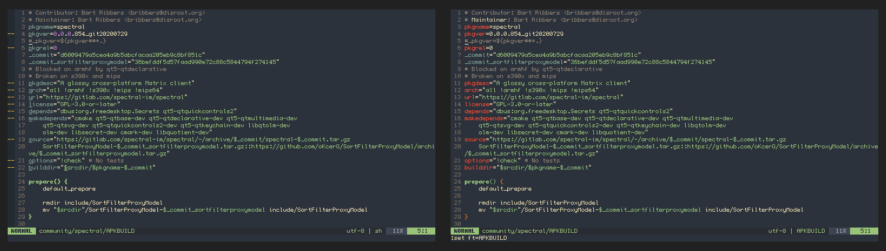
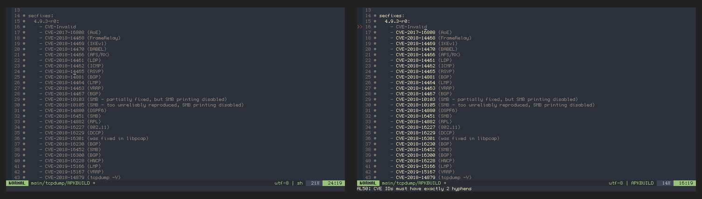
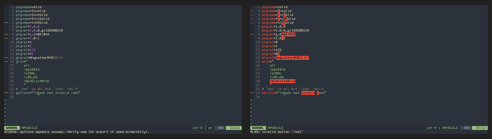

> Article by editor Leo <thinkabit.ukim@gmail.com>

The Linux distro I contribute to, [Alpine Linux][1], uses build recipes called
APKBUILDs, which are shell scripts but with context-aware variables that can
affect the final result of package and subject to policies that only apply to
[Alpine Linux][1] and its packaging system `abuild`.

[Vim][3] is a widely used text editor, many of our developers and users use it
to edit APKBUILDs daily, but while vim has a filetype for shellscripts, it is
insufficient to provide syntax, plugins, indentation and other nice to have
features that are specific to the context of an APKBUILD.

In light of that I took upon myself to write a complete implementation of
a vim `filetype`, specific for APKBUILDs.

Meet [APKBUILD.vim][2].

<!--more-->

## The Whole Deal

[APKBUILD.vim][2] is a plugin for Vim and [Neovim][4], that provides:

1. Syntax Highlighting:  
    1.1. Different colors for variables that affect `abuild` behavior.  
    1.2. Error highlight for invalid values inside `abuild` variables, like non-existant arches in `arch`.
    1.4. Highlights `secfixes:` blocks, version identifiers and recognized security identifiers (CVE, XSA, etc).  
    1.5. Built on top of `sh.vim` so all syntax highlight from `filetype=sh` is there underneath.
2. Configuration:  
    2.1. Sets correct `textwidth` of 80 columns.  
    2.2: Sets `noexpandtab` as APKBUILD uses tabs for indentation.  
    2.3: Sets `softtabstop` and `shiftwidth` to 4.
3. [ALE][5] Integration:  
    3.1. Provides a script to run [shellcheck][6] with APKBUILD aware filtering and register it into ALE.  
    3.2. Add linters for `apkbuild-lint` and `secfixes-check` from [atools][7] and a handler for them.

## Pictures

Here are some side by side comparisons of APKBUILDs with `filetype=sh` and `filetype=APKBUILD`:

> Main block of variables used by `abuild`, notice that the variables that are from `abuild`
> have a different color than the ones normally used by shell.

> Comparison of secfixes, notice how the `secfixes:` declaration, the versions and the security
> identifiers are all highlighted.

> General comparison of Error highlighting.

[1]: https://alpinelinux.org
[2]: https://gitlab.alpinelinux.org/Leo/apkbuild.vim
[3]: https://www.vim.org/
[4]: https://neovim.io
[5]: https://github.com/dense-analysis/ale
[6]: https://www.shellcheck.net/
[7]: https://gitlab.alpinelinux.org/Leo/atools
